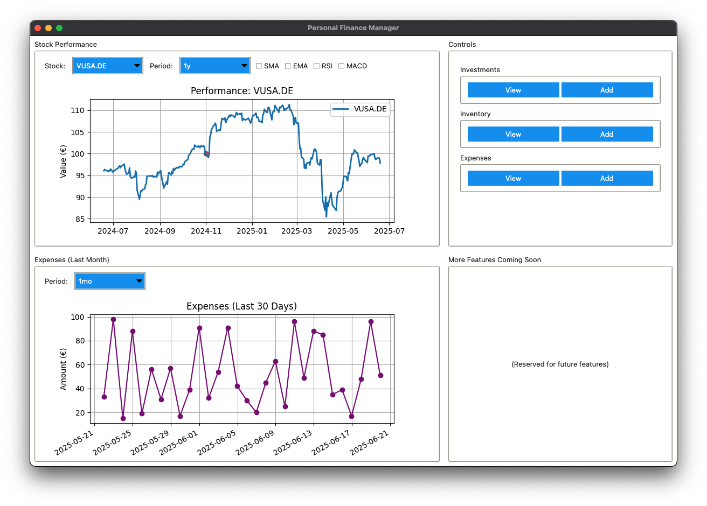

# Personal Finance Manager

A Python-based personal finance management application for tracking investments, inventory, and expenses. Features local data storage, real-time stock analysis, and privacy-first design.



## Features

- **Investment Tracking**: Stocks, bonds, crypto, real estate with multiple purchase support
- **Inventory Management**: Track physical assets and collectibles
- **Expense Monitoring**: Simple expense recording and categorization
- **Technical Analysis**: Real-time charts with RSI, MACD, moving averages
- **Modern UI**: Material Design with light/dark themes
- **Privacy First**: All data stored locally on your device

## Installation

**Prerequisites**: Python 3.8+

```bash
# Clone and setup
git clone <repository-url>
cd personal_finance
python -m venv venv
source venv/bin/activate  # Windows: venv\Scripts\activate

# Install and run
pip install -e .
personal-finance-manager

# Or run from source
pip install -r requirements.txt
python main.py
```

## Usage

1. **Add Items**: Use forms for investments, inventory, or expenses
2. **View Portfolio**: Track performance in the main dashboard
3. **Analyze**: Interactive charts with technical indicators
4. **Export**: CSV export for data portability

## Documentation

- **[Configuration Guide](CONFIGURATION.md)**: Settings and themes
- **[Development Guide](DEVELOPMENT.md)**: Development workflow
- **[Changelog](CHANGELOG.md)**: Version history

## License

Licensed under **GNU Affero General Public License v3.0 (AGPL-3.0)**. See [LICENSE](LICENSE) for details.

---

**Personal finance management with privacy-first design. All data stored locally.**
